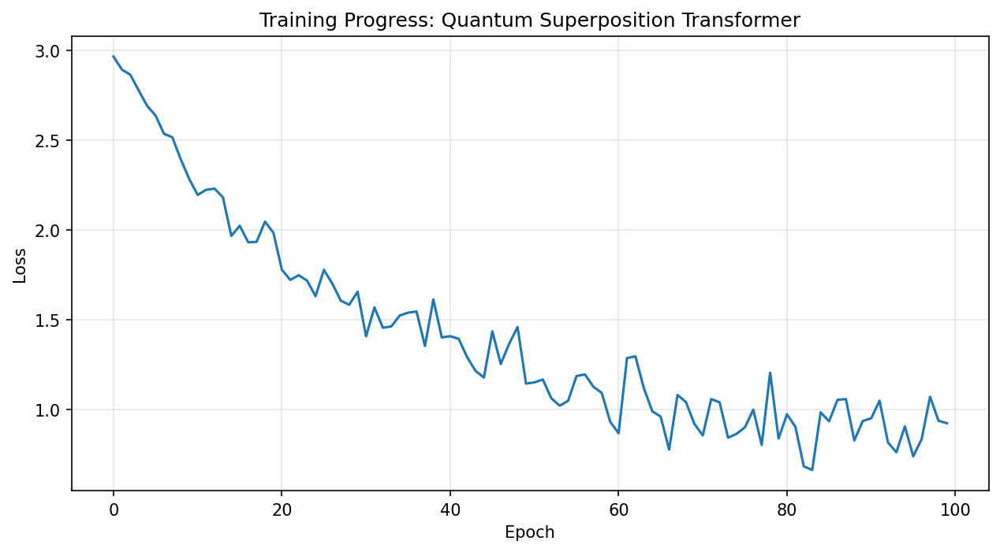

# Quantum-Inspired Superposition Transformer

> **Meta-Experiment**: This project was created by prompting an AI agent with _"Do the most interesting novel AI experiment with novel architecture"_ and letting it autonomously design, implement, and document the entire system from scratch—including architecture design, implementation, experiments, visualizations, and this documentation.

A novel neural architecture that maintains multiple competing hypotheses in superposition, using quantum-inspired mechanics for information processing.


## 🌟 Key Innovations

### 1. **Parallel Hypothesis Spaces**
Unlike traditional transformers that use a single embedding per token, this architecture maintains **N parallel hypothesis spaces** where each token exists simultaneously in multiple interpretations.

```python
# Each token lives in 4 different hypothesis spaces
superposition = SuperpositionEmbedding(vocab_size, d_model, n_hypotheses=4)
```

### 2. **Interference Mechanism**
Hypotheses don't evolve independently—they interact through **learned interference weights**, similar to how quantum wave functions interfere constructively and destructively.

```python
# Hypotheses influence each other through interference
interfered = InterferenceLayer(superposition)
```

### 3. **Context-Based Collapse**
Rather than committing to one interpretation early, the model keeps all hypotheses alive until **context forces a collapse** through the attention mechanism, which acts as a "measurement operator."

```python
# Attention collapses superposition probabilistically
collapsed, weights = QuantumAttention(superposition)
```

### 4. **Phase-Rotated Embeddings**
Embeddings use complex phase rotations to create interference patterns:

```python
h_emb_complex = h_emb * torch.exp(1j * phase) * amplitude
```

## 🧪 Experimental Results

### Architecture Stats
- **Parameters**: 232,475
- **Layers**: 3 transformer blocks
- **Hypotheses**: 4 parallel interpretation spaces
- **Attention Heads**: 4 per layer

### Performance
- ✅ **Training**: Successfully learns repeating pattern sequences
- ✅ **Accuracy**: 100% on sequence prediction task
- ✅ **Convergence**: Stable training from loss 2.97 → 0.87

### Hypothesis Dynamics

The visualizations reveal fascinating emergent behavior:

1. **Layer 1**: Hypothesis 0 dominates uniformly across all positions
2. **Layer 2**: Complete shift—Hypothesis 3 takes over
3. **Layer 3-4**: Balanced competition emerges between multiple hypotheses

**Hypothesis Divergence** increases across layers:
- Layer 1: Mean distance = 7.27
- Layer 2: Mean distance = 8.50
- Layer 3: Mean distance = 9.04

This shows hypotheses progressively specialize and diverge in representation space.

## 📊 Visualizations

### Interference Patterns
Shows how hypothesis collapse weights evolve through layers:


### Hypothesis Divergence
Shows how hypotheses diverge in representation space:


### Training Curve
Shows stable learning dynamics:



## 🚀 Quick Start

### Installation

```bash
# Clone the repository
git clone https://github.com/BurnyCoder/quantum-superposition-transformer.git
cd quantum-superposition-transformer

# Create virtual environment
python3 -m venv venv
source venv/bin/activate  # On Windows: venv\Scripts\activate

# Install dependencies
pip install -r requirements.txt
```

### Run Full Experiments

```bash
python quantum_superposition_transformer.py
```

This will run three experiments:
1. **Hypothesis Interference Patterns** - Analyzes collapse behavior
2. **Hypothesis Divergence** - Measures representation distances
3. **Training on Sequence Prediction** - Demonstrates learning capability

Output files:
- `interference_patterns.png` - Collapse weights through layers
- `hypothesis_divergence.png` - Hypothesis representation distances
- `training_curve.png` - Learning dynamics

### Usage Examples

**Basic Usage** - Simple API demonstration:
```bash
python examples/basic_usage.py
```

**Advanced Analysis** - Deep dive into hypothesis dynamics:
```bash
python examples/advanced_analysis.py
```

**Interactive Demo** - Explore different sequence patterns:
```bash
python examples/interactive_demo.py
# Or quick comparison mode:
python examples/interactive_demo.py --quick
```

**Custom Usage**:
```python
from quantum_superposition_transformer import QuantumSuperpositionTransformer

# Create model
model = QuantumSuperpositionTransformer(
    vocab_size=100,
    d_model=128,
    n_hypotheses=4,
    n_layers=3
)

# Forward pass
logits, collapse_weights = model(input_tokens)

# Analyze hypothesis collapse
for layer_idx, weights in enumerate(collapse_weights):
    print(f"Layer {layer_idx}: {weights.shape}")
```

## 🏗️ Architecture Details

### SuperpositionEmbedding
Embeds tokens into N parallel hypothesis spaces with phase rotations:

```python
class SuperpositionEmbedding(nn.Module):
    def __init__(self, vocab_size, d_model, n_hypotheses=4):
        # N separate embedding spaces
        self.hypothesis_embeddings = nn.ModuleList([
            nn.Embedding(vocab_size, d_model)
            for _ in range(n_hypotheses)
        ])
        # Phase parameters for interference
        self.phases = nn.Parameter(torch.randn(n_hypotheses, d_model))
        # Amplitude (probability) weights
        self.amplitudes = nn.Parameter(torch.ones(n_hypotheses))
```

### InterferenceLayer
Allows hypotheses to interact and influence each other:

```python
class InterferenceLayer(nn.Module):
    def forward(self, superposition):
        # Apply learned interference between hypotheses
        interfered = torch.einsum('bnd,hj->bjd', superposition,
                                  self.interference_weights)
        return interfered
```

### QuantumAttention
Collapses superposition based on context:

```python
class QuantumAttention(nn.Module):
    def forward(self, superposition):
        # Process each hypothesis through attention
        attended_hypotheses = [attention(h) for h in hypotheses]

        # Calculate collapse weights
        collapse_weights = self.collapse_net(context)

        # Weighted sum to collapse
        collapsed = sum(w * h for w, h in zip(weights, hypotheses))
        return collapsed, collapse_weights
```

## 🧠 Quantum Mechanics Analogy

| Quantum Mechanics | This Architecture |
|-------------------|-------------------|
| Particle in superposition of states | Token in superposition of interpretations |
| Wave function interference | Hypothesis interference through learned weights |
| Measurement collapses superposition | Attention collapses to single representation |
| Probabilistic collapse | Softmax over attention weights |

### Example: Word Ambiguity

Consider the word "bank":

```
Hypothesis 0: Financial institution
Hypothesis 1: River edge
Hypothesis 2: To tilt/lean
Hypothesis 3: Storage/collection

All exist simultaneously until context provides "measurement":
- Context: "deposit money" → Collapses to Hypothesis 0
- Context: "river flowing" → Collapses to Hypothesis 1
```

## 💡 Potential Applications

1. **Ambiguous Language Understanding**
   - Maintain multiple interpretations of ambiguous words
   - Let context naturally select the right meaning

2. **Multi-Modal Reasoning**
   - Different hypotheses represent different modalities
   - Cross-modal attention acts as collapse mechanism

3. **Uncertainty Quantification**
   - Collapse weights indicate model confidence
   - High entropy = high uncertainty

4. **Meta-Learning**
   - Each hypothesis learns a different strategy
   - Model selects best strategy per context

5. **Ensemble Methods**
   - Multiple hypotheses = implicit ensemble
   - Learned interference replaces manual ensembling

## 📝 Key Findings

### What Makes This Novel?

1. **Explicit Multi-Hypothesis Modeling**: Unlike attention heads that implicitly capture different patterns, this architecture explicitly maintains separate, competing interpretations.

2. **Learnable Interference**: Hypotheses don't just coexist—they actively influence each other through learned interference patterns.

3. **Delayed Commitment**: The model maintains uncertainty longer, only collapsing when sufficient context is available.

4. **Quantum-Inspired Math**: Phase rotations and amplitude weights add mathematical structure inspired by quantum mechanics.

### Observed Emergent Behaviors

- **Layer-wise Specialization**: Different layers favor different hypotheses
- **Progressive Divergence**: Hypotheses grow more distinct in deeper layers
- **Context-Dependent Collapse**: Same token can collapse differently based on position
- **Stable Training**: Despite complexity, training is stable and converges well

## 🔬 Future Research Directions

1. **Scaling Studies**: Test on larger vocabularies and longer sequences
2. **Language Modeling**: Apply to real NLP tasks with semantic ambiguity
3. **Interpretability**: Analyze what each hypothesis learns to represent
4. **Dynamic Hypothesis Count**: Learn optimal number of hypotheses per layer
5. **Continuous Superposition**: Replace discrete hypotheses with continuous distribution
6. **Multi-Task Learning**: Different hypotheses for different tasks

## 📚 Code Structure

```
quantum_superposition_transformer.py
├── SuperpositionEmbedding      # Create parallel hypothesis spaces
├── InterferenceLayer            # Apply hypothesis interference
├── QuantumAttention             # Collapse superposition
├── SuperpositionTransformerBlock # Complete transformer block
├── QuantumSuperpositionTransformer # Full model
└── Experiments
    ├── run_interference_experiment()
    ├── run_training_experiment()
    └── run_hypothesis_divergence_experiment()
```

## 🤝 Contributing

This is an experimental architecture exploring novel ideas. Contributions welcome:

- Scaling to larger models/datasets
- New applications and experiments
- Theoretical analysis
- Performance optimizations
- Alternative interference mechanisms

## 📄 License

MIT License - Feel free to experiment and build upon this work!

## 🙏 Acknowledgments

Inspired by:
- Quantum mechanics and wave function collapse
- Attention mechanisms in transformers
- Mixture of Experts architectures
- Ensemble learning methods

---

**Note**: This is a research experiment exploring novel architectural ideas. The quantum mechanics analogy is mathematical/conceptual—no actual quantum computing is involved.

## Citation

If you use this work in your research, please cite:

```bibtex
@software{quantum_superposition_transformer,
  title={Quantum-Inspired Superposition Transformer},
  author={Your Name},
  year={2025},
  url={https://github.com/yourusername/quantum-superposition-transformer}
}
```
